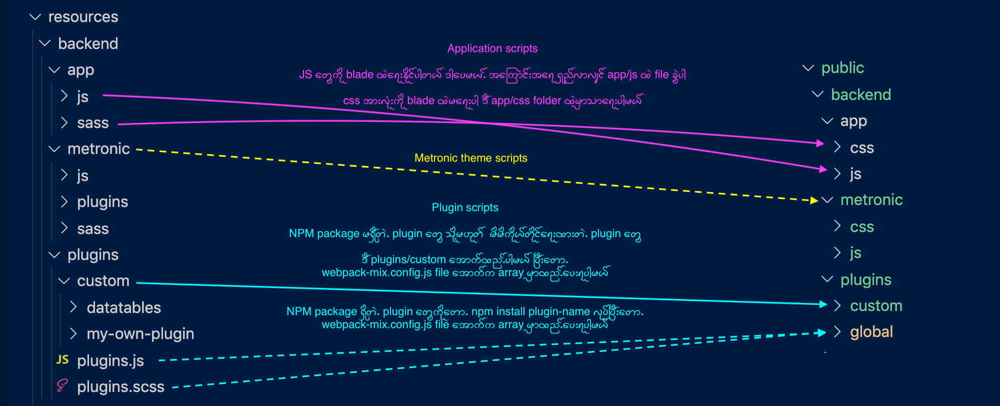

# Laravel Mix 

There are three options for Laravel Mix compiling process

1. [Application scripts](#application)
2. [Plugins scripts](#plugin)
3. [Metronic theme scripts](#metronic)

## 1. Application scripts <a name="application"></a>

`resources/backend/app/js` နဲ့ `resources/backend/app/sass` အောက်က js/css အားလုံး

------------------
## 2. Plugins scripts <a name="plugin"></a>

`resources/backend/plugins/custom` အောက်က plugins တွေရဲ့ js/css အားလုံး

#### Plugin အသစ်ထည့်နည်း 

##### npm ရှိတဲ့ plugin တစ်ခုကို ထည့်မယ်ဆို 
- `npm install plugin-name` လုပ်ပါ
- `webpack.mix.js` အောက်က **npm_plugins** array ထဲကို အောက်က object အတိုင်းထည့်ပါ 

```javascript
 {
        name:'plugin-name',
        dist_folder:'node_modules/plugin-name/dist'
 }
```

##### npm မရှိတဲ့ plugin တစ်ခုကို ထည့်မယ်ဆို 
- plugin folder ကို `resources/backend/plugins/custom` ထဲကိုထည့်ပါ
- ပြီးလျှင် `webpack.mix.js` အောက်က **no_npm_plugins** array ထဲ folder directory ထည့်ပါ 


Laravel Mix run လိုက်လျှင် plugins အားလုံးက `public/backend/plugins/custom` ထဲကိုရောက်သွားပါမယ်။ ပြီးတော့မှ blade ထဲမှာချိတ်သုံးရပါမယ်။ 

> မှတ်ချက် ။ ။ public folder အောက်ကို plugin အသစ် တိုက်ရိုက် မထည့်သင့်ပါ။

------------------

## 3. Metronic theme scripts <a name="metronic"></a>

Laravel Mix run လိုက်လျှင်  `resources/backend/metronic` အောက်က metronic js/css အားလုံးကို compile လုပ်သွားပါလိမ့်မယ် 

------------



> dashed lines တွေက တစ်ခါပဲ run ဖို့လိုအပ်တယ် 

