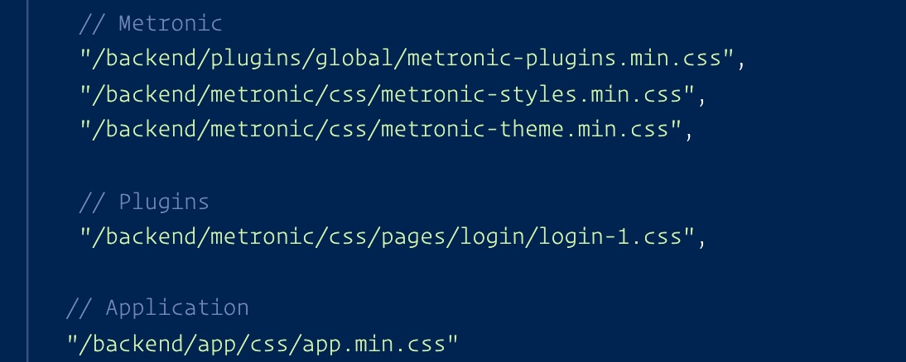

# Blade Template ကအဓိက ၃ ပိုင်း

* Metronic
* Plugins
* Application

## CSS

```markup
<!-- Metronic -->
<link rel="stylesheet" href="metronic-plugins.min.css">
<link rel="stylesheet" href="metronic-styles.min.css">
<link rel="stylesheet" href="metronic-theme.min.css">

<!--  Plugins -->
<link rel="stylesheet" href="custom-plugins.css">

<!--  Application -->
<link rel="stylesheet" href="app.min.css">
```

## JS

```markup
<!-- Metronic -->
<script src="/metronic-plugins.min.js"></script>
<script src="/metronic-scripts.min.js"></script>

<!--  Plugins -->
<script src="/custom-plugins.js"></script>
<!-- stack scripts -->

<!-- Application -->
<script src="/app.min.js"></script>
```

ဥပမာပုံ 

