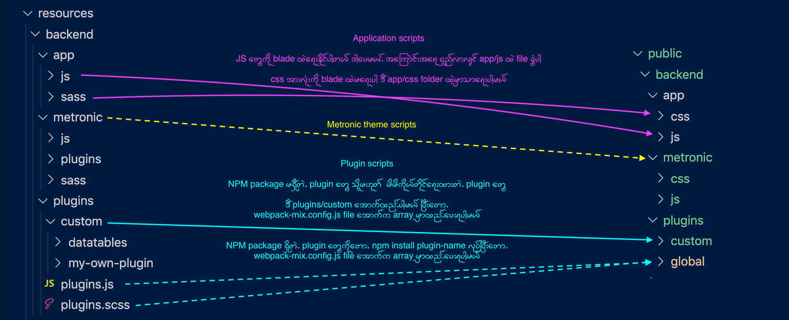

# Laravel Mix

There are three options for Laravel Mix compiling process

1. [Mix config](mix.md#config)
2. [Application scripts](mix.md#application)
3. [Plugins scripts](mix.md#plugin)
4. [Metronic theme scripts](mix.md#metronic)

## 1. Mix config

Mix ရဲ့ အဓိက config ကိုပြင်မယ်ဆို `webpack.mix.js` ထဲမှာ အောက်ကအတိုင်းထည့်ထားပါတယ်

```javascript
// Reset and re-run all scripts
const reset_and_re_run_all_scripts        = false;


// --- Remove folders [optional] ---- //

// True will remove plugins folders under spublic/backend/plugins/custom before compiling
let remove_plugins_folders_under_public   = true; 

// True will remove metronic folder under public/backend before compiling
let remove_metronic_folders_under_public  = true; 


// --- Run scripts [optional] ---- //

// True will compile only application scripts under "resources/backend/app" folders without touching Metronic's core/bundle/theme scripts.
let compile_application_scripts           = false; 

// True will compile only plugins scripts under "resources/backend/plugins/custom" without touching Metronic's core/bundle/theme scripts.
let compile_plugins_scripts               = false; 

// True will compile only Metronic scripts under "resources/backend/metronic" without touching Application and plugin scripts.
let compile_metronic_scripts              = false;
```

`reset_and_re_run_all_scripts` ကတော့ ပထမဆုံး အကြိမ်မှာ true ပေးသင့်ပြီး နောက်ပိုင်းမှာတော့ reset မလုပ်မချင်း အမြဲ false ထားတာကောင်းပါတယ်

ကျန်တဲ့ optional variables တွေဖြစ်တဲ့

```text
remove_plugins_folders_under_public , remove_metronic_folders_under_public , compile_application_scripts , compile_plugins_scripts , compile_metronic_scripts
```

စတာတွေကို run မယ်ဆို အပေါ်က `reset_and_re_run_all_scripts` ကို false ထားပေးရပါမယ်

## 2. Application scripts

`resources/backend/app/js` နဲ့ `resources/backend/app/sass` အောက်က js/css အားလုံး

## 3. Plugins scripts

`resources/backend/plugins/custom` အောက်က plugins တွေရဲ့ js/css အားလုံး

### Plugin အသစ်ထည့်နည်း

#### npm ရှိတဲ့ plugin တစ်ခုကို ထည့်မယ်ဆို

* `npm install plugin-name` လုပ်ပါ
* ပြီးလျှင် `webpack.mix.plugins.js` file ထဲက **npm\_plugins** array ထဲကို အောက်က object အတိုင်းထည့်ပါ 

```javascript
 {
        name:'plugin-name',
        dist_folder:'node_modules/plugin-name/dist'
 }
```

#### npm မရှိတဲ့ plugin တစ်ခုကို ထည့်မယ်ဆို

* plugin folder ကို `resources/backend/plugins/custom` ထဲကိုထည့်ပါ
* ပြီးလျှင် `webpack.mix.plugins.js` file ထဲက **no\_npm\_plugins** array ထဲ folder directory ထည့်ပါ 

Laravel Mix run လိုက်လျှင် plugins အားလုံးက `public/backend/plugins/custom` ထဲကိုရောက်သွားပါမယ်။ ပြီးတော့မှ blade ထဲမှာချိတ်သုံးရပါမယ်။

> မှတ်ချက် ။ ။ public folder အောက်ကို plugin အသစ် တိုက်ရိုက် မထည့်သင့်ပါ။

## 4. Metronic theme scripts

Laravel Mix run လိုက်လျှင် `resources/backend/metronic` အောက်က metronic js/css အားလုံးကို compile လုပ်သွားပါလိမ့်မယ်



> dashed lines တွေက တစ်ခါပဲ run ဖို့လိုအပ်တယ်

