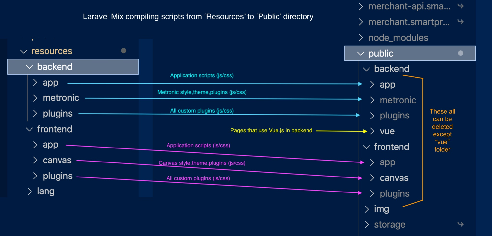

# Script compiling

## Laravel Mix

Run`npm start` to start the compilation process.

There will be a few questions that asking project and environment.

Projects

* backend
* backend-vue
* frontend

Environment

* dev
* watch
* prod 

This diagram shows how Laravel mix compiles the sources files from **resources** and move them to **public** directory. 

